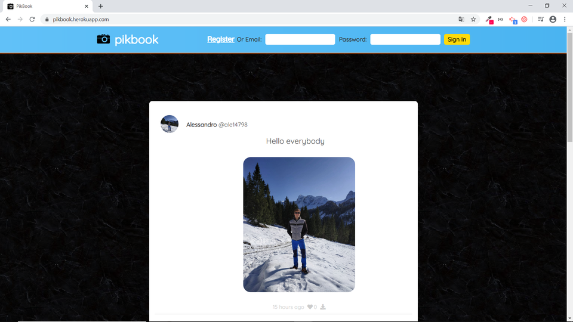
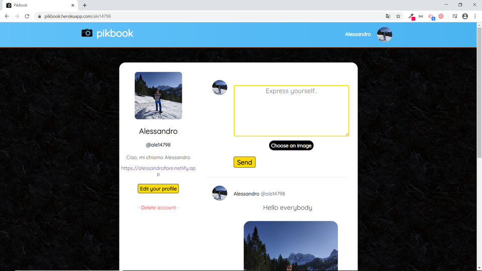
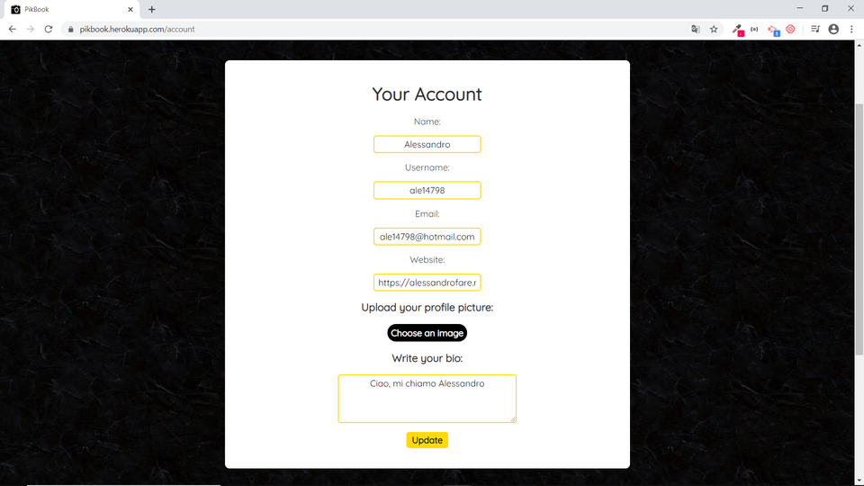
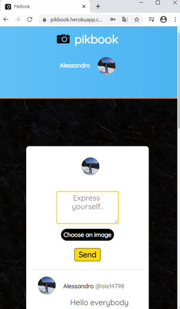

# PikBook

Full Stack responsive social network made with Node.js, MongoDB, Express.js &amp; Passport.js and connected to Cloudinary to upload and store images.

* **Demo:** [https://pikbook.herokuapp.com/](https://pikbook.herokuapp.com/)

## Built with:

* [Node.js](https://cloudinary.com/)
* [Express.s](https://nodejs.org/en/)
* [MongoDB](https://www.mongodb.com/)
* [Passport.js](http://www.passportjs.org/)
* [Cloudinary](https://cloudinary.com/)

## Project

### Home



### Profile



### Profile settings



### Responsive home


  
## Prerequisites

You should install Node.js, Git and the other Javascript's npm packages that you can find in the package.json file under "dependencies".

## Installing

Download or clone the repository, open the terminal and navigate into the github folder with cd command.

* Install dependencies

```
npm install (or -> npm i)
```

* Create variables.env file in the root and replace values with yours:

```
PORT=3000
DATABASE=your mongoDB driver url or your local database url
SECRET=what you want
```

#### Change DATABASE url and SECRET message. PORT is 3000 because of heroku deploy, but you can change it.

* Create .env file in the root and replace values with yours:

```
CLOUD_NAME=your cloud name in cloudinary
API_KEY=your api_key 
API_SECRET=your api_secret
```

#### These are cloudinary account's variables. You have to create an account on [Cloudinary](https://cloudinary.com/), go to Dashboard, copy your account details and paste into .env file.


## Run on localhost

Run in your terminal:

```
npm run dev (or -> node app.js)
```
and go to http://localhost:3000/

## Author

* **Alessandro Farè**
